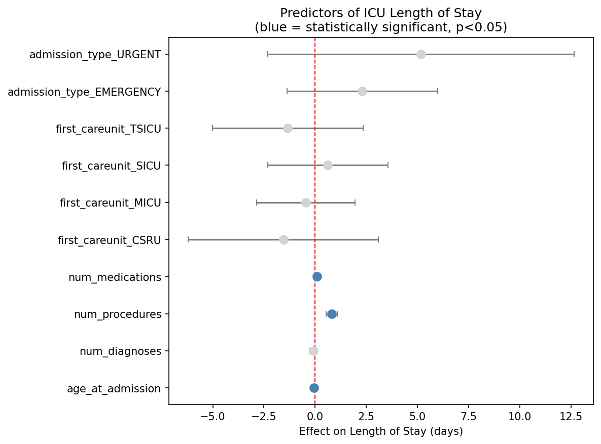

# ICU Length of Stay: SQL Analysis & Predictors

Analyzing ICU patient data with SQL to answer a real clinical operations
question: what predicts how long a patient stays in intensive care? Built
on the MIMIC-III Clinical Database Demo, using SQL for data extraction
and analysis, and a regression model to identify genuine predictors
across the full sample.

**Interactive dashboard:** [View on Tableau Public](https://public.tableau.com/views/ICULengthofStaySQLAnalysisPredictorsMIMIC-IIIDemo/DashboardLOSSQLAnalysisPredictors)

## Motivation

Hospitals use ICU length of stay (LOS) for capacity planning and resource
allocation. This project investigates what factors, such as diagnosis, insurance
type, age, and treatment intensity, are associated with longer ICU stays,
using real (de-identified) clinical data and proper statistical methods to
distinguish genuine signal from small-sample noise.

## Dataset

[MIMIC-III Clinical Database Demo](https://physionet.org/content/mimiciii-demo/1.4/)
(PhysioNet) — 100 patients, 129 admissions, 136 ICU stays. Publicly
available with no credentialing required. Loaded into SQLite for querying.

## Methods

- **Database:** 25 MIMIC-III tables loaded into SQLite via Python/pandas
- **SQL techniques used:** joins, subqueries, correlated subqueries,
  aggregation, `HAVING` clauses, `GROUP BY`
- **Statistical modelling:** multiple linear regression (`statsmodels`),
  testing age, illness complexity (diagnosis count), treatment intensity
  (procedure and medication counts), care unit, and admission type as
  predictors of LOS
- **Age filter:** 9 admissions excluded where MIMIC's de-identification
  process shifts ages 89+ to appear as 300+ years old (not real values)

## Key findings

### 1. LOS by primary diagnosis (directional, small samples)
Liver conditions (acute necrosis, hepatic encephalopathy, cirrhosis) and
heart failure show the longest average stays; infections and kidney/urinary
issues the shortest. Most diagnosis categories have only 2–6 admissions,
so these patterns are clinically plausible but not statistically robust
individually — read as directional, not definitive.

### 2. LOS by insurance type (confounded, not causal)
Medicaid admissions show the longest average stay (8.4 days), followed by
Private (5.9) and Medicare (3.9). This should not be read as insurance
*causing* longer stays, but rather it more likely reflects underlying differences
in health status and access to care prior to admission.

### 3. What actually predicts LOS: a multiple regression (n=127)
A regression combining age, diagnosis count, procedure count, medication
count, care unit, and admission type explains over half the variation in
LOS (**R² = 0.54, p < 0.001**).

**Number of procedures (p<0.001) and number of medications (p=0.001) are
the strongest predictors** — patients who underwent more procedures and
received more distinct medications had meaningfully longer stays. Age was
a significant but weaker predictor (p=0.041). Diagnosis count, care unit,
and admission type showed no independent effect once treatment intensity
was accounted for — diagnosis count's earlier apparent effect turned out
to be a proxy for treatment intensity, not diagnosis type itself.

**Conclusion:** how intensively a patient is treated — not which
conditions they're diagnosed with or which unit they're in — is the
strongest signal of ICU length of stay in this dataset.

## Interactive dashboard

All three descriptive findings (diagnosis, insurance, age) are available
as an interactive Tableau Public dashboard, letting you explore the
underlying data directly:

**[View the dashboard](https://public.tableau.com/views/ICULengthofStaySQLAnalysisPredictorsMIMIC-IIIDemo/DashboardLOSSQLAnalysisPredictors)**

## Notebook

- `notebooks/P2_sql_analysis.ipynb` — full analysis: database setup, schema
  exploration, SQL queries, regression modelling, visualizations

## Tools

Python (pandas, SQLite3, statsmodels, matplotlib), SQL, Tableau Public
